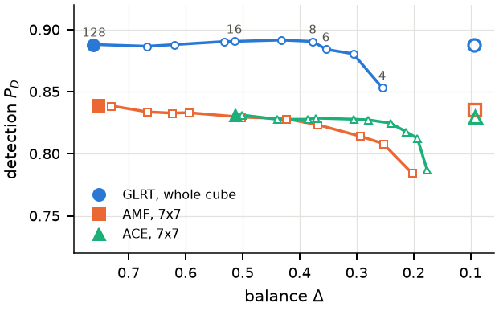

# {{PAPER TITLE}}

[{{Author One}}](https://example.com), [{{Author Two}}](https://example.com)

**[Paper (arXiv)]({{ARXIV_LINK}})** | **[Project page]({{PROJECT_PAGE_LINK}})** | **[Published version]({{DOI_LINK}})**

Official implementation of *{{PAPER TITLE}}* ({{VENUE, YEAR}}).

<p align="center">
  
</p>

## Abstract

{{One-paragraph abstract, copied from the paper.}}

## Installation

```bash
git clone https://github.com/{{ORG}}/{{REPO}}.git
cd {{REPO}}
pip install -r requirements.txt
```

Tested with Python {{3.x}} on {{OS}}.

## Reproducing the results

Every figure and table in the paper corresponds to one script in `experiments/`:

| Result in paper | Command |
|---|---|
| Figure 1 | `python experiments/figure1.py` |
| Table 1  | `python experiments/table1.py` |

Outputs are written to `results/`.

## Data

{{Describe the data. If it is generated synthetically, say so. If it must be
downloaded, provide `data/download_data.sh` and describe it here.}}

## Repository structure

```
src/           Core implementation of the method
experiments/   Scripts reproducing each figure/table in the paper
data/          Data or download scripts
docs/          Project page (served via GitHub Pages)
```

## Citation

If you find this work useful, please cite:

```bibtex
@article{{{CITEKEY}},
  title   = {{{PAPER TITLE}}},
  author  = {{{AUTHORS}}},
  journal = {{{VENUE}}},
  year    = {{{YEAR}}}
}
```

## License

This project is released under the MIT License. See [LICENSE](LICENSE).
